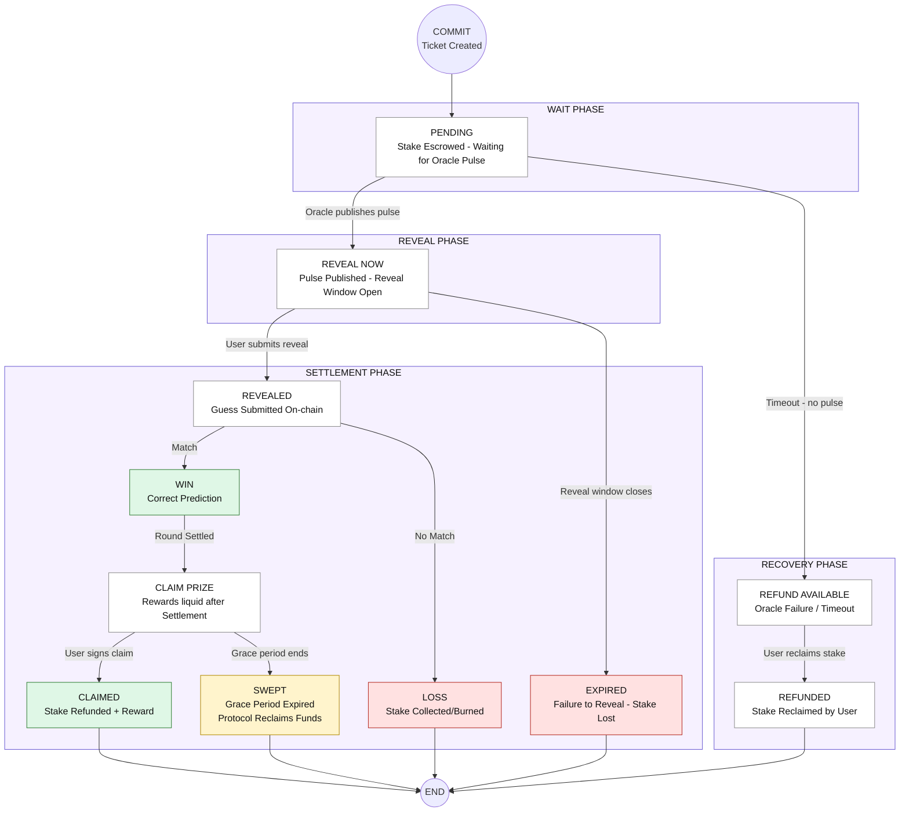

# TIMLG Ticket Lifecycle & Protocol Specification

This document details all possible states of a ticket in the TIMLG protocol, from the initial user commitment to its final settlement on the Solana blockchain.

## Lifecycle Diagram

The following state machine represents the deterministic flow of every ticket:

## State Explanations

1.  **PENDING**: The ticket is registered on-chain. The stake is held in the round vault while waiting for the public randomness pulse (e.g., NIST Beacon).
2.  **REVEAL NOW**: The pulse is available on-chain. Users must submit their original guess and salt to prove their commitment.
3.  **WIN**: The revealed guess matches the target bit of the pulse. Reward is pending round settlement.
4.  **LOSS**: The guess does not match. The protocol burns or collects the stake based on tokenomics configuration.
5.  **EXPIRED**: The user failed to reveal within the reveal window. The account risk is handled by the protocol.
6.  **SWEPT**: A winning prize was ready but the user failed to claim it within the configured grace period. The protocol authority executes a sweep to recover the funds.
7.  **REFUND AVAILABLE**: An emergency state triggered if the Oracle fails to provide the pulse within the expected slot window (+150 slots). Users can reclaim their stake.

## Implementation References

The automated logic for this protocol is implemented in the [/oracle](./oracle) directory:
- **Round Maintenance**: See `create_round_auto_devnet.js`.
- **Pulse Publishing**: See `run_oracle_devnet.js` and `nist.js`.
- **Settlement Engine**: See `settle_round_tokens_auto_devnet.js`.
